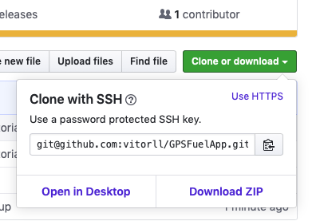
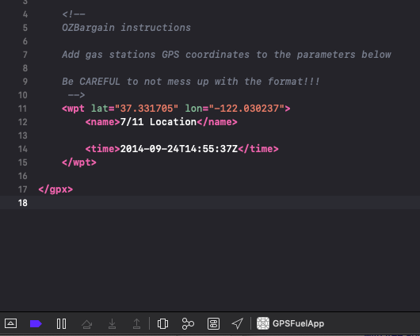
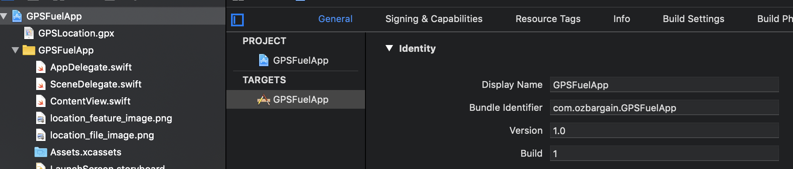
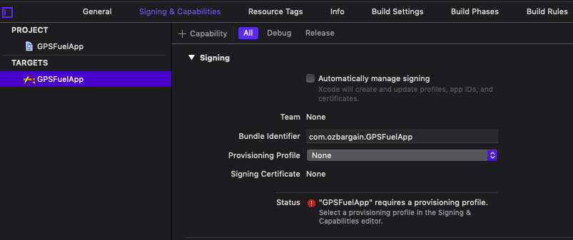
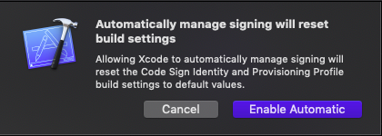
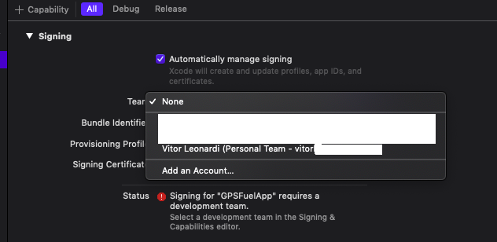
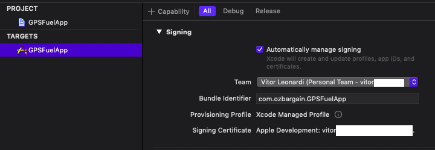
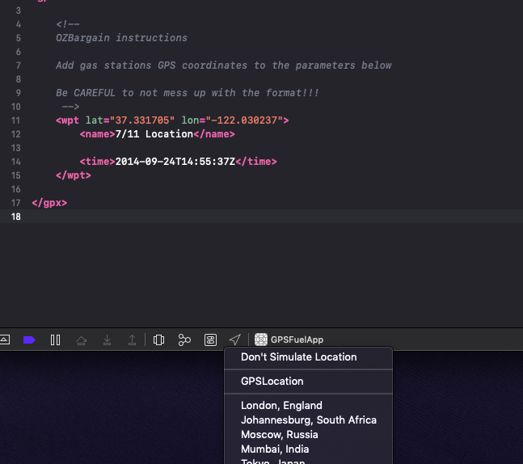

# This is a sample app that allows you to spoof GPS location

## Contents

- [Requirements](#requirements)
- [First Time Setup](#first_time_setup)
- [Day To Day Usage](#day_to_day_usage)

## Requirements
[top](#contents)

- Mac OS
- iPhone
- Xcode (https://apps.apple.com/au/app/xcode/id497799835?mt=12)
- Setup your machine and iPhone for development (https://www.twilio.com/blog/2018/07/how-to-test-your-ios-application-on-a-real-device.html)

## First Time Setup
[top](#contents)

1. Download the project to your machine
	- 
2. Open the project file (GPSFuelApp.xcodeproj)
3. Select GPSLocation.gpx file (https://github.com/vitorll/GPSFuelApp/blob/master/GPSFuelApp/GPSLocation.gpx)	
	- 
4. Enter the desired GPS coordinates
5. Change the bundle identifier for the project (needs to be unique eg. com.yourcoolname.GPSFuelApp)
	- 
6. Go to Signing and Capabilities tab and tap Automatically manage signing
	- 
7. Click on Enable Automatic
	- 
8. Click on Provisioning Profile and select your personal team profile
	- 
9. This should be the end result of this configuration, which will allow you to proper run the app in your device
	- 
10. Select your device as target (top bar menu, change from simulator to your connected iPhone)
11. Run the project (play arrow at the top)
12. Enable location simulation by selecting GPSLocation option in this menu
	- 

Now your iPhone will use the same location as defined in the GPSLocation.gpx file. 

You can now change to any maps app to check out if it's working

That's it

## Day To Day Usage
[top](#contents)

1. Open the project
2. Select GPSLocation.gpx file (https://github.com/vitorll/GPSFuelApp/blob/master/GPSFuelApp/GPSLocation.gpx)	
	- 
3. Enter the desired GPS coordinates
4. Select your device as target
5. Run the project
6. Enable location simulation by selecting GPSLocation option in this menu
	- 
