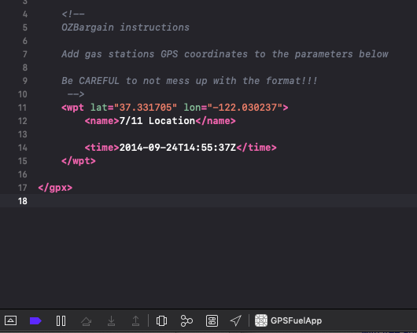
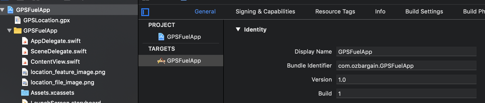
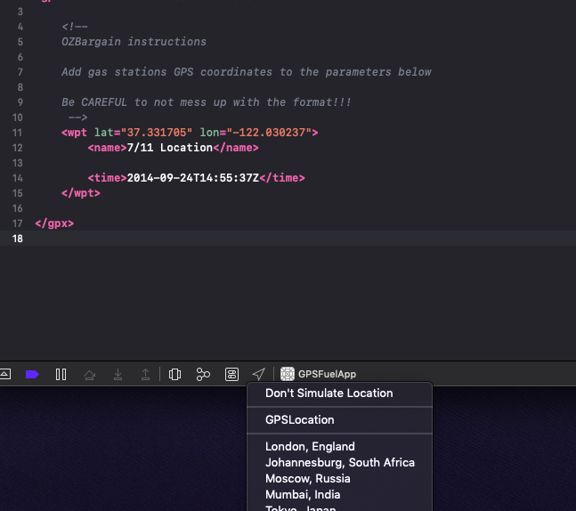

## This is a sample app that allows you to spoof GPS location

### Requirements:

- Mac OS
- Xcode (https://apps.apple.com/au/app/xcode/id497799835?mt=12)

### How to run apps in your device:

https://www.twilio.com/blog/2018/07/how-to-test-your-ios-application-on-a-real-device.html

### First time use:

1. Download the project in your machine
2. Open the project
3. Select GPSLocation.gpx file (https://github.com/vitorll/GPSFuelApp/blob/master/GPSFuelApp/GPSLocation.gpx)	
	- 
4. Enter the desired GPS coordinates
5. Change the bundle identifier for the project (needs to be unique eg. com.yourcoolname.GPSFuelApp)
	- 
6. Select your device as target (top bar menu, change from simulator to your connected iPhone)
7. Run the project (play arrow at the top)
8. Enable location simulation (select GPSLocation option in this menu)
	- 

Now your iPhone will use the same location as defined in the GPSLocation.gpx file. 

You can now change to any maps app to check out if it's working

That's it

### Day to day use:

1. Open the project
2. Select GPSLocation.gpx file (https://github.com/vitorll/GPSFuelApp/blob/master/GPSFuelApp/GPSLocation.gpx)	
	- 
3. Enter the desired GPS coordinates
4. Select your device as target
5. Run the project
6. Enable location simulation	
	- 
